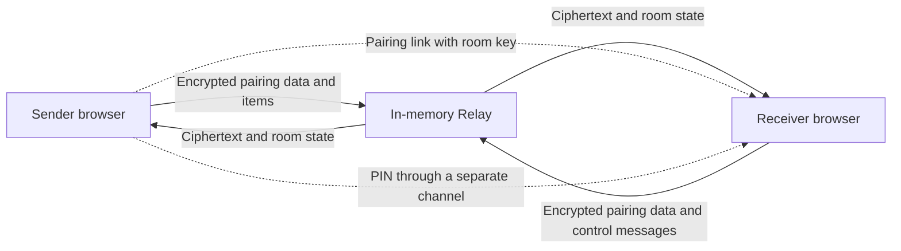

<div align="center">

# KeyBridge

**Send short-lived encrypted text from a desktop browser to a phone browser.**

[](https://github.com/tjallo/keybridge/actions/workflows/checks.yaml)
[](https://github.com/tjallo/keybridge/releases)
[](https://github.com/tjallo/keybridge/pkgs/container/keybridge)
[](LICENSE)

No accounts · No database · No analytics · No persistent vault

</div>

> [!IMPORTANT]
> **AI-assisted personal project**
>
> Most of this project was written with generative AI under the maintainer's direction. The maintainer built KeyBridge as a personal tool and reviews and tests its behavior. No independent security audit has occurred. Review the [security model](docs/security-model.md), source, and deployment configuration before you use it for sensitive data.

## What KeyBridge does

KeyBridge transfers passwords, tokens, recovery codes, and configuration text between two browsers. A desktop **Sender** creates a room. A phone **Receiver** opens the pairing link and enters a PIN received through a separate channel.

The browsers encrypt pairing messages and secret values before transmission. The in-memory **Relay** forwards and temporarily retains ciphertext. It does not receive the room key, PIN, or plaintext.

| Property        | Behavior                                                  |
| --------------- | --------------------------------------------------------- |
| Topology        | One Sender, one Receiver, and one Relay process           |
| Encryption      | HKDF-SHA-256 and AES-256-GCM through Web Crypto           |
| Storage         | Relay memory and browser `sessionStorage` only            |
| Item lifetime   | 30, 60, 120, or 300 seconds                               |
| Room lifetime   | 10 minutes after creation, item storage, or extension     |
| Reconnection    | Independent 60-second grace period for each browser       |
| Browser support | Current Chrome, Firefox, and Safari on desktop and mobile |

KeyBridge is not a password manager, file-transfer service, or long-term secret store. A Relay restart ends every room and removes its in-memory state.

## How it works



The pairing link stores the room key in its URL fragment. Browsers do not send URL fragments to the Relay. The Sender must approve the Receiver before the Relay forwards secret items.

## Try it locally

You need Docker. Run the published container on the loopback interface:

```sh
docker pull ghcr.io/tjallo/keybridge:2.2.0

docker run --rm --name keybridge \
  --read-only \
  --tmpfs /tmp \
  --cap-drop=ALL \
  --security-opt=no-new-privileges:true \
  -p 127.0.0.1:3000:3000 \
  -e PUBLIC_ORIGIN=http://localhost:3000 \
  ghcr.io/tjallo/keybridge:2.2.0
```

Open `http://localhost:3000` on the same computer. Do not connect a physical phone to this HTTP endpoint. Mobile deployment requires a trusted HTTPS origin.

## Deploy with Docker

Production requires one KeyBridge container behind a Transport Layer Security (TLS) reverse proxy. Do not run multiple replicas or add persistent room storage.

A minimal Caddy site block proxies HTTP and WebSocket traffic:

```caddyfile
keybridge.example.com {
    reverse_proxy keybridge:3000
}
```

The [self-hosting guide](docs/self-hosting.md) provides the matching Docker Compose configuration. The guide also covers network isolation and trusted proxy settings.

## Security boundaries

KeyBridge protects secret payloads while they pass through the Relay. It does not make the web server trustless. A compromised server can supply modified JavaScript that captures keys or plaintext.

KeyBridge also cannot protect against compromised devices, browser extensions, screen capture, clipboard residue, memory dumps, or a malicious Relay that retains ciphertext. Encrypted envelope version 1 has no application-layer forward secrecy.

Read the [security model](docs/security-model.md) before deployment. It defines the supported claim, visible metadata, Relay powers, and known limits.

## Documentation

| Document                                  | Contents                                                            |
| ----------------------------------------- | ------------------------------------------------------------------- |
| [Self-hosting](docs/self-hosting.md)      | Docker, Caddy, HTTPS, proxy trust, updates, and operational limits  |
| [Development](docs/development.md)        | Development containers, checks, browser tests, builds, and releases |
| [Security model](docs/security-model.md)  | Security claim, metadata exposure, trust boundaries, and exclusions |
| [Protocol version 2](docs/protocol.md)    | Current transport, room lifecycle, reconnection, limits, and errors |
| [Protocol version 1](docs/protocol-v1.md) | Archived transport and the current encrypted-envelope key schedule  |

## License

KeyBridge uses the [MIT License](LICENSE). The license includes the applicable warranty disclaimer.
